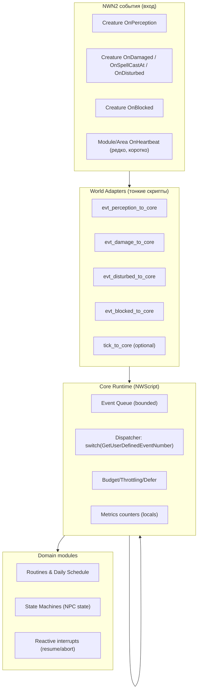
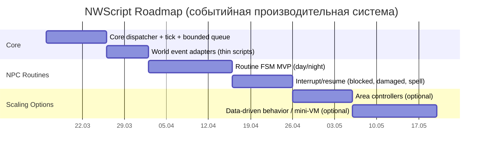

# Высокопроизводительная событийная архитектура NWScript для NWN2

## Executive summary и рамки исследования

Исследование начато с подключённого коннектора **GitHub** (api_tool) и ограничено репозиторием **lncaster-cell/NPC** как источником ваших идей/концептов и внутренней терминологии. Дальше я расширил анализ за счёт **поиска в интернете по NWN2/NWScript**, чтобы сравнить с типовыми решениями и best practices (приоритет — NWN2‑справочники, затем общие материалы по NWScript).  

**Ваша цель сформулирована не полностью**, поэтому я фиксирую, что это *моя интерпретация*: вы хотите **архитектуру проекта именно на NWScript (NWN2)** — максимально **производительную**, **событийную**, и **пошагово реализуемую**, без лишних “внешних” историй вроде лаунчеров/протоколов синхронизации. Если я где-то предлагаю “доп. слой”, я объясняю, зачем он вообще нужен, и даю альтернативу проще.

Ключевой технический факт, на который опирается весь дизайн: в NWN2 есть мощная “шина событий” через **OnUserDefined** и нумерацию событий (1001 Heartbeat, 1002 Perception и т. п.), которую BioWare/Obsidian реально использовали как мультиплексор — то есть много обработчиков могут сводиться в один, а различие идёт номером события. citeturn5search6turn0search4turn0search5  
Ключевой перф‑риск: **OnHeartbeat** срабатывает примерно раз в ~6 секунд, и “слишком много heartbeat‑скриптов” процессорно дорого — рекомендуют максимально уходить в событийность и консолидацию. citeturn5search0turn5search1

Дальше — сначала что именно NWScript даёт для событийной архитектуры, затем несколько альтернатив реализации (чтобы было из чего выбрать), затем референс‑архитектура и поэтапный план (ядро → рутины → реакции → расширение).

## Что важно про NWScript в NWN2 для событийной и производительной системы

### OnUserDefined как “встроенный event bus”
В NWN2 (и в NWScript‑линейке в целом) типовой паттерн выглядит так:

- Вы **создаёте событие** `EventUserDefined(n)` и **посылаете** его `SignalEvent(target, e)`. citeturn0search5turn6search15turn6search0  
- В обработчике **OnUserDefined** читаете номер через `GetUserDefinedEventNumber()` и маршрутизируете `switch/case`. citeturn5search6turn6search1  

Это буквально стандартный механизм “один вход — много причин вызова”. Обучающий пример для NWN2 Toolset прямо показывает: 1001 для “псевдо‑heartbeat”, 1002 для perception, и всё это разбирается в одном `OnUserDefined`. citeturn5search6

**Важное ограничение**: для собственных кастомных событий лучше не использовать диапазоны, которые уже заняты BioWare. В документации по EventUserDefined специально отмечено: **1000–1011, 1510, 1511 лучше избегать** для своих кастомных event numbers, потому что они используются движком/стандартными событиями при сигналинге в user-defined. citeturn6search0  
Практический вывод: для вашей системы стоит зарезервировать, например, **3000+** под внутренние события системы (чтобы не конфликтовать со стандартными).

### Динамическая привязка обработчиков к событиям через SetEventHandler
NWN2 поддерживает рантайм‑перепривязку: `SetEventHandler(oObject, iEventID, sScriptName)` — “привязать любой скрипт к событию объекта”. citeturn0search1  
Список `Event ID` констант для существ (например `CREATURE_SCRIPT_ON_NOTICE`, `CREATURE_SCRIPT_ON_DAMAGED`, `CREATURE_SCRIPT_ON_USER_DEFINED_EVENT`) опубликован в NWN2‑справочнике. citeturn0search0

Это критично для архитектуры “плагины/компоненты”: вы можете на `OnSpawn` навешивать “компонентные обработчики” на NPC (или снимать их), не переписывая базовые скрипты.

### Производительность: что действительно бьёт по серверу
Самое прикладное, что подтверждают источники:

- **OnHeartbeat обычно каждые ~6 секунд**, и многие heartbeat‑скрипты могут сжечь CPU; рекомендуется использовать другие события где возможно. citeturn5search0turn5search1  
- Для PW‑практик отдельно советуют: держать heartbeat lean, избегать частых циклов по инвентарям, следить за loop‑ами GetFirst/GetNext и ставить “sanity counters”, иначе возможны 100% CPU lockups. citeturn5search1  
- Есть готовый пример “как делать тайминги без постоянных проверок”: **hourly/day-night events** для NWN2 — модульный heartbeat раз в час сигналит `OnUserDefined` у area‑скрипта и сообщает переходы “dusk→night” и т. п.; пример применения — “NPC идут домой ночью и возвращаются днём”. citeturn5search4  

**Вывод**: “максимальная производительность” в NWScript обычно означает:

1) **не размножать** heartbeats по объектам,  
2) **консолидировать** периодическую работу (на модуль/зону),  
3) **делать bounded work**: ограничивать объём обработок за тик/heartbeat,  
4) **событийность**: реагировать на нужные события, а не постоянно опрашивать мир.

## Альтернативные варианты реализации и сравнение для выбора

Ниже — три рабочие архитектуры NWScript‑системы (все событийные), разной степени “централизации”. Это варианты, а не “единственно верный путь”.

### Сравнительная таблица
| Вариант | Идея | Как маршрутизируются события | Плюсы | Минусы | Где лучше всего |
|---|---|---|---|---|---|
| Централизованное ядро “Module Dispatcher” | Один главный диспетчер на модуле держит очередь событий и вызывает подсистемы | Все входные события (NPC/Area) конвертируются в `SignalEvent(GetModule(), EventUserDefined(X))`, а модульный `OnUserDefined` делает `switch` и вызывает обработчики citeturn0search5turn6search15turn5search6 | Максимальный контроль производительности: у вас один “котёл” budget/очередей; проще наблюдаемость | Риск “монолита”: диспетчер разрастается и становится сложным | Когда важна предсказуемость, а нагрузка должна быть строго bounded |
| Area‑controller (распределённая оркестрация) | У каждой активной зоны есть свой контроллер/диспетчер (area `OnUserDefined`) с бюджетом | Модульный heartbeat/события отправляют сигналы в конкретные area‑контроллеры (можно через готовый hourly system) citeturn5search4 | Масштабируется по зонам: активные зоны работают, пустые почти молчат; естественно отсекает “пустой мир” | Сложнее глобальные решения (между зонами); нужно аккуратно роутить события “куда слать” | Когда у вас много зон, и вы хотите, чтобы пустые зоны почти ничего не делали |
| Компонентная модель “NPC scripts as components” | NPC сами держат поведение в навешиваемых обработчиках, ядро минимально | На `OnSpawn`/`SetEventHandler` навешиваются нужные скрипты‑компоненты на события NPC citeturn0search1turn0search0 | Локальность кода: проще думать про конкретного NPC; меньше глобальной инфраструктуры | Легко получить “1000 маленьких сердцебиений” и потерять контроль; тяжелее гарантировать bounded поведение | Когда NPC немного, или поведение очень разное, и вам важна переиспользуемость компонентов |

### Рекомендация выбора “по умолчанию”
Если ваш приоритет — **максимальная производительность и управляемость**, чаще всего лучше стартовать с:

- **Вариант 1 (Module Dispatcher)**, если у вас относительно небольшой мир, или вы хотите абсолютно железный контроль над budget.  
- **Вариант 2 (Area‑controller)**, если много зон и вы хотите “пустые зоны молчат”.

**Вариант 3** я бы оставил как “внутренний стиль модулей”: даже при централизованном ядре вы можете использовать `SetEventHandler` как механизм “плагинов” для отдельных NPC, но не делать так, чтобы вся система зависела от per‑NPC heartbeats. citeturn5search0turn5search1turn0search1

## Референс‑архитектура NWScript для вашей задачи

Ниже — “сборка идей в систему”: чёткие границы ответственности, точки интеграции и минимальный набор контрактов (чтобы потом было просто расширять).

### Границы ответственности модулей
Я предлагаю разделить NWScript‑проект на 4 слоя, которые хорошо ложатся на NWN2‑событийность и не требуют внешних инструментов:

- **Core Runtime**: очередь событий, бюджет, маршрутизация, диагностика.  
- **World Adapters**: тонкие “переводчики” входных событий NWN2 (perception/damaged/disturbed/blocked/spellcastat) в внутренние события Core.  
- **Domain Modules**: рутины/расписания/реакции/городские правила — чистая логика, без “сканов мира”.  
- **Content Contracts**: соглашения по тегам/locals/waypoints (не как отдельный протокол синхронизации, а как “строительные правила” для билдера).

### Архитектурная диаграмма потоков событий


Вся схема реализуется через стандартный паттерн `SignalEvent + EventUserDefined + GetUserDefinedEventNumber`, который прямо описан в обучающих материалах по NWN2. citeturn0search5turn5search6turn6search15

### Минимальные контракты ядра
Чтобы система была расширяемой и не превращалась в кашу, лучше сразу договориться о двух вещах:

1) **Диапазоны event numbers**:  
- 1001/1002/… — стандартные (движок/BioWare), не трогать как “свои”; список EVENT_* известен. citeturn0search4turn6search0  
- 3000+ — ваши внутренние события (например `SYS_EVT_TICK = 3000`, `SYS_EVT_ROUTINE_STEP = 3100`, и т. п.). Это соответствует рекомендациям избегать занятых диапазонов. citeturn6search0  

2) **Гарантия bounded‑обработки**:  
каждый обработчик обязуется “работать быстро” и не делать неограниченных циклов. Если нужен обход списка — только порциями, с sanity counters (как рекомендуют PW‑гайдлайны). citeturn5search1turn5search0

### Псевдокод ядра (NWN2‑стиль)
Это пример “минимально жизнеспособного” диспетчера.

```c
// sys_core_ud.nss — модульный OnUserDefined
// ВАЖНО: кастомные события держим >= 3000 (чтобы не конфликтовать с 1001/1002 и др.)
void main()
{
    int ev = GetUserDefinedEventNumber(); // стандартная точка чтения номера события citeturn6search1

    // Быстрый route: никакой тяжелой логики прямо тут.
    switch (ev)
    {
        case 1001: // EVENT_HEARTBEAT "рекуррентный" citeturn0search4turn5search6
            Sys_Tick();
            break;

        case 3000: // SYS_EVT_TICK (если делаете явный tick event)
            Sys_Tick();
            break;

        case 3100: // SYS_EVT_ROUTINE_STEP
            Routines_HandleStep();
            break;

        case 3200: // SYS_EVT_REACT_INTERRUPT
            React_HandleInterrupt();
            break;

        default:
            // неизвестное событие: либо игнор, либо счетчик
            Sys_IncUnknownEvent(ev);
            break;
    }
}
```

## Пошаговый план реализации именно NWScript: ядро → рутины → расширение

Вы просили прямой план в стиле “1. ядро, 2. рутины, 3. …”. Ниже — roadmap, но с двумя важными свойствами:

- каждый шаг даёт **готовый результат**, который можно тестировать в игре;
- каждый шаг добавляет **минимум** новых механизмов, без “перепридумывания” протоколов.

### Таблица этапов, тестов и критериев приёмки
| Шаг | Цель | Что делаем в NWScript | Артефакт | Приёмка (как проверить) | Риски | Как снизить |
|---|---|---|---|---|---|---|
| Ядро системы | Создать центральную событийную оркестрацию и basis для производительности | 1) модульный `OnUserDefined` как dispatcher; 2) единый `Sys_Tick()`; 3) очередь событий с ограничением размера; 4) простые метрики (locals) | `sys_core_ud.nss`, `sys_tick.nss`, `sys_queue.nss` | Тест: искусственно “накидать” N событий через `SignalEvent(GetModule(), EventUserDefined(3000+))` и убедиться, что система обрабатывает bounded‑порциями, а overflow фиксируется (без лагов) | Очередь/тик станет “монолитом” | Сразу разделить: dispatcher только маршрутизирует, тяжелое — в модулях |
| Слой адаптеров событий мира | Сделать систему реально событийной (не опросной) | Для ключевых событий NPC (perception/damaged/disturbed/blocked) пишем тонкие обработчики, которые “сигналят” в Core | `evt_*_to_core.nss` | Тест: спровоцировать событие (удар/перцепция/инвентарь) и увидеть, что в Core пришло событие, а обработчик отработал быстро | Много событий одновременно (burst) | Ввести приоритеты/квоты на обработку событий за тик |
| Дневные активности и рутины NPC (MVP) | Рутины без per-NPC heartbeat, управляемые центральным тик-циклом | Вводим FSM состояния NPC: `IDLE / GO_TO_WP / WORK / GO_HOME / SLEEP`. Рутины обновляем порциями: “не более K NPC за тик”. Для смены времени используем hourly/day-night event pattern (или собственный таймер), чтобы не проверять время каждую секунду citeturn5search4turn5search0 | `mod_routine.nss`, `mod_schedule.nss` | Тест: NPC днём “работает”, ночью “идёт домой”, и всё это без отдельного heartbeat на каждом NPC; сервер не деградирует при 20/50/100 NPC | Pathfinding/blocked ломают FSM | Добавить обработку OnBlocked как interrupt (см. следующий шаг) |
| Реакции и прерывания (interrupt/resume) | Реалистичность + устойчивость: реагировать на события и возвращаться в рутину | Приоритетные события (damaged/spellcastat/blocked) переводят NPC в `INTERRUPTED` и ставят “маркер возврата” в состояние рутины. OnBlocked — уход на альтернативную точку или “перепланировать позже” | `mod_react.nss` | Тест: NPC идёт по маршруту → получает урон → реагирует → возвращается к рутине без зависания | Возможен “шторм событий” вокруг толпы NPC | Дедупликация (не ставить 10 одинаковых interrupt подряд), квоты/сэмплирование |
| Масштабирование: area‑контроллер (опционально) | Если много зон, разгрузить модульный диспетчер | Вводим area controller (area `OnUserDefined`), который принимает только события своей зоны и исполняет локальные очереди | `area_controller_ud.nss` | Тест: пустые зоны почти “молчат”, активная зона работает; суммарный CPU стабильнее | Сложнее межзонные решения | Межзонные события маршрутизировать через модуль, всё остальное — локально |
| Данные/контент‑driven поведение (опционально) | Упростить добавление новых рутин без переписывания кода | Мини‑DSL в терминах NWScript: таблица “час → действие”, “тег → маршрут”, “роль → список WP”; интерпретатор выполняет шаги | `mod_behavior_vm.nss` | Тест: сменить данные маршрута и “поведение поменялось” без изменения логики | Риск переусложнения | Делать только после стабильного ядра и MVP рутин |

### Mermaid‑таймлайн (в духе поэтапности)


Сроки здесь ориентировочные; важнее, что порядок этапов соответствует принципам производительности: сначала bounded ядро, потом рутины, потом реактивность, потом масштабирование.

## Best practices и анти‑паттерны NWScript для максимальной производительности

### Что делать (практики)
Консолидируйте периодическую работу на модуле/ареа‑слое: heartbeat “дорогой”, его должно быть мало и он должен быть коротким. citeturn5search0turn5search1  
Используйте `OnUserDefined` как мультиплексор: это стандартный приём — одно место, где вы различаете, кто позвал (1001 heartbeat, 1002 perception) и что делать. citeturn5search6turn0search4  
Для дневного цикла не надо проверять время “каждый тик”: лучше использовать готовую идею hourly/day-night сигналов (2060..2064), чтобы рутины реагировали на событие “наступил час/смена дня”, а не опрашивали время. citeturn5search4

### Чего избегать (анти‑паттерны)
Не плодите per‑NPC heartbeat‑скрипты “для всего”: слишком много heartbeats дорого, и PW‑гайдлайны подчёркивают держать их lean и следить за ними особенно тщательно. citeturn5search0turn5search1  
Не делайте тяжёлых бесконечных `GetFirst/GetNext` обходов без предохранителя: в PW‑практиках прямо рекомендуют “sanity loops”, иначе возможны 100% CPU lockups. citeturn5search1  
Не используйте занятые диапазоны event numbers для своих внутренних событий: рекомендовано избегать 1000–1011 и некоторых других, чтобы не конфликтовать со стандартной системой сигналинга событий в OnUserDefined. citeturn6search0

### Мини‑чеклист “производительность по умолчанию”
Если хочешь “максимально производительно”, то каждую новую подсистему пропускай через три вопроса:

1) Можно ли сделать это **событием**, а не опросом? (OnDisturbed/OnDamaged/OnPerception вместо heartbeat‑проверок) citeturn5search6turn0search4  
2) Есть ли **жёсткая верхняя граница работы** за тик (K событий / K NPC / K шагов)?  
3) Есть ли **предохранители** от burst/loop (sanity counters, queue caps)? citeturn5search1  

---

Если ты скажешь, какой вариант из трёх (Module Dispatcher / Area Controller / Component‑based) тебе ближе по ощущению и по масштабу мира (примерно: сколько зон активно и сколько NPC в “живой” зоне), я сузлю архитектуру до одного выбранного варианта и дам прям “список скриптов” (имена файлов, публичные функции, какие события на что подписаны) — но уже без лишних допущений.
